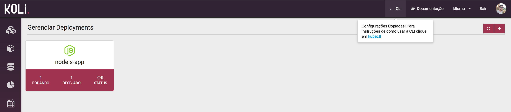

`kubectl` é a interface de linha de comando que usamos para gerenciar as aplicações no __Koli__. Esse overview irá cobrir a sintaxe do `kubectl`, descrever as operações dos comandos além de prover alguns exemplos comuns de uso.

* TOC
{:toc}

### Instalação

Aqui estão alguns métodos para instalar o `kubectl`.

#### Instalar com curl


##### MacOS
1. Download a última versão do kubectl:

       curl -LO https://storage.googleapis.com/kubernetes-release/release/$(curl -s https://storage.googleapis.com/kubernetes-release/release/stable.txt)/bin/darwin/amd64/kubectl

    Para fazer o download  de uma versão específica, substitua `$(curl -s https://storage.googleapis.com/kubernetes-release/release/stable.txt)` com a versão desejada.

    Por exemplo, para fazer o download da versão {{page.fullversion}} no MacOS, execute:

       curl -LO https://storage.googleapis.com/kubernetes-release/release/{{page.fullversion}}/bin/darwin/amd64/kubectl

2. Torne o kubectl executável.

    ```
    chmod +x ./kubectl
    ```

3. Mova o binário para seu PATH.

    ```
    sudo mv ./kubectl /usr/local/bin/kubectl
    ```

##### Linux
1. Download a última versão do kubectl:

       curl -LO https://storage.googleapis.com/kubernetes-release/release/$(curl -s https://storage.googleapis.com/kubernetes-release/release/stable.txt)/bin/linux/amd64/kubectl

    Para fazer o download  de uma versão específica, substitua `$(curl -s https://storage.googleapis.com/kubernetes-release/release/stable.txt)` com a versão desejada.

    Por exemplo, para fazer o download da versão {{page.fullversion}} no Linux, execute:

       curl -LO https://storage.googleapis.com/kubernetes-release/release/{{page.fullversion}}/bin/linux/amd64/kubectl

2. Torne o kubectl executável.

    ```
    chmod +x ./kubectl
    ```

3. Mova o binário para seu PATH.

    ```
    sudo mv ./kubectl /usr/local/bin/kubectl
    ```

##### Windows

1. Download a última versão do kubectl {{page.fullversion}} [nesse link](https://storage.googleapis.com/kubernetes-release/release/{{page.fullversion}}/bin/windows/amd64/kubectl.exe).

    Ou, se voce possui `curl` instalado, use o seguinte comando:

       curl -LO https://storage.googleapis.com/kubernetes-release/release/{{page.fullversion}}/bin/windows/amd64/kubectl.exe

    Para descobrir a última versão estável, veja em https://storage.googleapis.com/kubernetes-release/release/stable.txt

2. Adicione o binário ao seu PATH.

#### Instalar com Homebrew no MacOS

1. Se voce usa MacOS e utiliza o gerenciador de pacotes [Homebrew](https://brew.sh/), voce pode instalar com o seguinde comando:

       brew install kubectl

2. Rode `kubectl version` para verifical qual a versão está instalada.


#### Instalar com Chocolatey no Windows

1. Se voce usa Windows e utiliza o gerenciador de pacotes [Chocolatey](https://chocolatey.org), voce pode instalar com o seguinte comando:

        choco install kubernetes-cli

2. Rode `kubectl version` para verifical qual a versão está instalada.

### Configuração

Para utilizarmos o `kubectl` precisamos definir seu arquivo de configuração com as devidas credenciais. Por padrão o arquivo de configuração é o `~/.kube/config`.

1. Para gerar esse arquivo de configuração acesse o **Portal Koli** e clique no Item <span class="tab-reference"><i class="tab-icon fa fa-terminal"></i>CLI</span> no menu superior.

<div class="article-image">
  
</div>

2. Crie o arquivo `~/.kube/config` com o conteúdo copiado.

    ``` sh
$ mkdir ~/.kube
$ vim ~/.kube/config
    ```
O conteúdo que copiou deve conter algo parecido como:

    ``` yaml
    kind: Config
    apiVersion: v1
    preferences:
    colors: true
    current-context: koli
    clusters:
    - cluster:
        server: https://api.kolihub.io
    name: koli
    contexts:
    - context:
        cluster: koli
        namespace: dev-duck-koli
        user: user@domain.com
    name: koli
    users:
    - name: user@domain.com
    user:
        token: bearer token
    ```

Para checar se sua configuração está funcionando rode:

```bash
kubectl cluster-info
```

### Sintaxe

Use a seguinte sintaxe para rodar `kubectl` no seu terminal.

```
kubectl [comando] [TIPO] [NOME] [flags]
```

Onde comando, TIPO, NOME e flags são:
- **comando**: Determina a operação que voce deseja executar em um ou mais recursos, por exemplo, create, get, describe, delete.
- **TIPO**: Determina o tipo do recurso. Recursos são 'case-sensitives` e voce pode especificar no singular, plural ou de forma abreviada (para os suportados). Por exemplo, os seguintes comandos produzem a mesma saída.

    ```bash
$ kubectl get pod pod1
$ kubectl get pods pod1
$ kubectl get po pod1
    ```
- **NOME**: Determina o nome do recurso. Nomes são `case-sensitive`. Se o nome é omitido, os detalhes de todos os recursos são apresentados, por exemplo

    ```bash
$ kubectl get pods
    ```

- **flags**: Determina flags opcionais. Por exemplo, voce pode utilizar -s ou --server para especificar o endereço da API.

Para mais informações digite `kubectl help` no terminal.


### Comandos Úteis

Nessa seção vamos ver alguns comandos úteis para gestão da sua aplicação.

#### Namespaces

O Kubernetes trabalha com o conceito de [Namespaces]({{ site.baseurl }}/concepts/namespaces.html). Os recursos são isolados lógicamente e para gerenciarmos precisamos passar o `Namespace` desejado. Para listar os seus `Namespaces` utilize o seguinte comando:

``` bash
$ kubectl get ns
NAME                 STATUS    AGE
dev-acme-koli        Active    10d
prod-acme-koli       Active    10d
```

#### Pods

Liste os [Pods]({{ site.baseurl }}/concepts/pods.html) do `Namespace` ___prod-acme-koli___.

``` bash
$ kubectl -n prod-acme-koli get po
NAME                           READY     STATUS    RESTARTS   AGE
koli-portal-1686868207-n5b3x   1/1       Running   0          13h
mariadb-1718711613-pgg9x       1/1       Running   0          6d
```

#### Logs

Voce pode visualizar os `Logs` de determinado `Pod`. 

No exemplo abaixo, estamos seguindo(-f) os `Logs` do `Pod` ___koli-portal-1686868207-n5b3x___ no `Namespace` ___prod-acme-koli___.

``` bash
$ kubectl -n prod-acme-koli logs koli-portal-1686868207-n5b3x -f
+ export HOME=/app
+ HOME=/app
+ mkdir -p /app
++ ls -A /app
...
```

#### Exec

O `Exec` executa determinado comando diretamente no `Pod`. Voce pode executar de forma iterativa com a opção -it. Isso é útil quando deseja 'logar' no bash do `Pod`. Por exemplo:

```bash
$ kubectl -n prod-acme-koli exec -it koli-portal-1686868207-n5b3x /bin/bash
slug@koli-portal-1686868207-n5b3x:~$
```

No exemplo acima estamos executando(exec) o comando `/bin/bash` de forma iterativa no `Pod` ___koli-portal-1686868207-n5b3x___  no `Namespace` ___prod-acme-koli___. Dessa forma voce poderá executar comandos dentro do `Pod`.

<div class="alert alert-warning">
  <strong>Atenção:</strong> Lembre-se que os Pods são efêmeros. As alterações que realizar em um container <strong>NÃO</strong> serão persistidas. Em eventual scale in ou scale down ou restart elas serão perdidas.
</div> 

#### Port-Forward

Voce pode mapear portas de um container na sua máquina local. Para isso utilize o comando `port-forward`. No exemplo abaixo estamos mapeando a porta ___3306___ do `Pod` ___mariadb-1718711613-pgg9x___  no `Namespace` ___prod-acme-koli___.

``` bash
$ kubectl -n prod-acme-koli  port-forward mariadb-1718711613-pgg9x 3306
Forwarding from 127.0.0.1:3306 -> 3306
Forwarding from [::1]:3306 -> 3306
```

Dessa forma podemos logar no MariaDB localmente. Por exemplo:

``` bash
$ mysql -h 127.0.0.1 -u root  -p
Enter password:
Welcome to the MySQL monitor.  Commands end with ; or \g.
Your MySQL connection id is 20
Server version: 5.5.5-10.2.6-MariaDB-10.2.6+maria~jessie mariadb.org binary distribution

Copyright (c) 2000, 2016, Oracle and/or its affiliates. All rights reserved.

Oracle is a registered trademark of Oracle Corporation and/or its
affiliates. Other names may be trademarks of their respective
owners.

Type 'help;' or '\h' for help. Type '\c' to clear the current input statement.

mysql>
```

### Erros

Caso voce tenha configurado e utilizado o `kubectl` e depois de um tempo passa a receber a mensagem abaixo:

```bash
$ kubectl get po
error: You must be logged in to the server (the server has asked for the client to provide credentials)
```

Seu token de sessão expirou. Voce deve gerar um novo token pelo **Portal Koli** e copia-lo para `~/.kube/config` seguindo as [instruções](#configuração) acima.