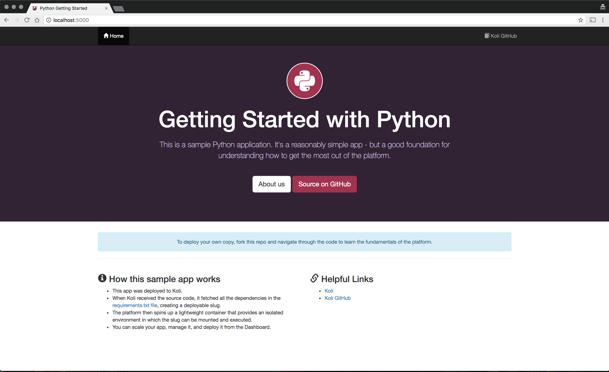

Para checar se sua aplicação está configurada corretamente para ser 'buildada' na plataforma, nós disponibilizamos uma ferramenta para fazer esse teste na sua máquina local.

* TOC
{:toc}

## Video Guia

<div class="article-video">
  <iframe width="60%" height="415" src="https://www.useloom.com/embed/4e63aa7a7dd74fd2b53e69b1db31ff38" frameborder="0" allowfullscreen></iframe>
</div>

## Docker

Para plataformas `Linux`, `Mac` e `Windows`. É possível validar localmente como sua aplicação irá se comportar quando lança-la na plataforma. Temos dois processos para cada vez que solicita um novo deploy, `Build` e `Run`, e em cada um é possível fazer essa simulação isoladamente. Aqui vamos simular o build e deploy local de uma de nossas apliações de [quick start](/quickstart).

### Build

[](https://quay.io/repository/koli/slugbuilder)

Para o processo de build, vamos baixar uma aplicação de exemplo:

```bash
$ cd /tmp
$ git clone https://github.com/koli/python-getting-started.git
$ cd python-getting-started
```

<div class="alert alert-warning">
  <strong>Atenção: </strong>Note que o path que estamos é <strong>/tmp/python-getting-started</strong>, isso é importante pois precisamos mapear o diretório da aplicação no container de build.
</div>

Agora vamos iniciar o build local com o comando abaixo. Na primeira vez que rodar, será baixado a imagem do [slugbuilder](https://quay.io/repository/koli/slugbuilder) na sua máquina, esse processo pode demorar um pouco.

```bash
$ docker run -i --rm --name koli-local --volume /tmp/python-getting-started:/app quay.io/koli/slugbuilder - > slug.tgz
```

<a class="btn btn-primary" data-toggle="collapse" href="#collapseBuild" aria-expanded="false" aria-controls="collapseBuild">
    Logs
</a>
<div class="collapse" id="collapseBuild">
    <pre><code>
-----> Python app detected
-----> Installing python-3.6.2
-----> Installing pip
-----> Installing requirements with pip
       Collecting dj-database-url==0.4.1 (from -r /tmp/build/requirements.txt (line 1))
       Downloading dj-database-url-0.4.1.tar.gz
       Collecting Django==1.11 (from -r /tmp/build/requirements.txt (line 2))
       Downloading Django-1.11-py2.py3-none-any.whl (6.9MB)
       Collecting gunicorn==19.6.0 (from -r /tmp/build/requirements.txt (line 3))
       Downloading gunicorn-19.6.0-py2.py3-none-any.whl (114kB)
       Collecting psycopg2==2.6.2 (from -r /tmp/build/requirements.txt (line 4))
       Downloading psycopg2-2.6.2.tar.gz (376kB)
       Collecting whitenoise==2.0.6 (from -r /tmp/build/requirements.txt (line 5))
       Downloading whitenoise-2.0.6-py2.py3-none-any.whl
       Collecting pytz (from Django==1.11->-r /tmp/build/requirements.txt (line 2))
       Downloading pytz-2017.2-py2.py3-none-any.whl (484kB)
       Installing collected packages: dj-database-url, pytz, Django, gunicorn, psycopg2, whitenoise
       Running setup.py install for dj-database-url: started
       Running setup.py install for dj-database-url: finished with status 'done'
       Running setup.py install for psycopg2: started
       Running setup.py install for psycopg2: finished with status 'done'
       Successfully installed Django-1.11 dj-database-url-0.4.1 gunicorn-19.6.0 psycopg2-2.6.2 pytz-2017.2 whitenoise-2.0.6

-----> $ python manage.py collectstatic --noinput
       63 static files copied to '/tmp/build/gettingstarted/staticfiles', 79 post-processed.

-----> Discovering process types
       Procfile declares types -> web
      </code></pre>
</div>

Como resultado do comando acíma, é gerado um arquivo `slug.tgz`. Esse é o conteúdo da sua aplicação já com todas dependências.

### Run
[](https://quay.io/repository/koli/slugrunner)

Com o arquivo de slug gerado no passo acima podemos rodar sua aplicação. Na primeira vez que rodar, será baixado a imagem do [slugrunner](https://quay.io/repository/koli/slugrunner) na sua máquina, esse processo pode demorar um pouco.

```bash
$ cat slug.tgz | docker run -i -p 5000:5000 --rm --name koli-local quay.io/koli/slugrunner start web
```

<a class="btn btn-primary" data-toggle="collapse" href="#collapseRun" aria-expanded="false" aria-controls="collapseRun">
    Logs
</a>
<div class="collapse" id="collapseRun">
    <pre><code>
[2017-08-26 17:27:58 +0000] [1] [INFO] Starting gunicorn 19.6.0
[2017-08-26 17:27:58 +0000] [1] [INFO] Listening at: http://0.0.0.0:5000 (1)
[2017-08-26 17:27:58 +0000] [1] [INFO] Using worker: sync
[2017-08-26 17:27:58 +0000] [22] [INFO] Booting worker with pid: 22
      </code></pre>
</div>

Como o container com sua aplicação rodando voce pode acessar localmente pelo endereço: <a href="http://localhost:5000" target="_blank"><i class="tab-icon fa fa-external-link"></i>http://localhost:5000</a>

<div class="article-image">
  <a href="images/python_web_1.png"></a>
</div>

## koli-local

`koli-local` é um script `bash` que abstrai os comandos acima.

<div class="alert alert-info">
  <strong>Nota: </strong> Rode os comandos sempre dentro do diretório raiz da sua apliacação.
</div>

```
koli-local up                 Builda e inicia a aplicação localmente.
koli-local stop               Para qualquer processo de build ou run rodando.
koli-local build              Apenas builda a aplicação gerando um arquivo slug.tgz com o código compilado.
koli-local run                Apenas roda a aplicação. Requer um arquivo slug.tgz no diretório corrente.
```

Para baixar a CLI use os seguintes comandos.

```
$ curl https://get.koli.com.br/koli-local -Lso /usr/local/bin/koli-local
$ chmod +x /usr/local/bin/koli-local
```

Certifique-se que tem permissão de escrita no diretório `/usr/local/bin`.

<a class="btn btn-primary" data-toggle="collapse" href="#collapseCode" aria-expanded="false" aria-controls="collapseCode">
    Código
</a>
<div class="collapse" id="collapseCode">
  <script src="https://gist.github.com/cainelli/7d5bcab16c53295d9623348b03dd8620.js"></script>
</div>