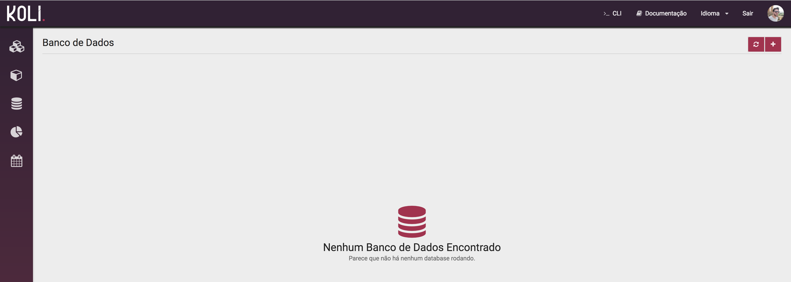
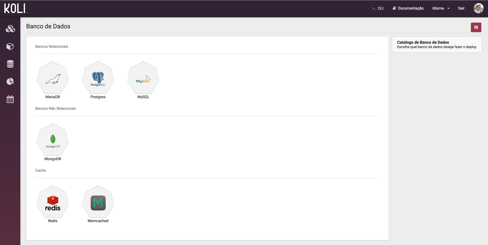
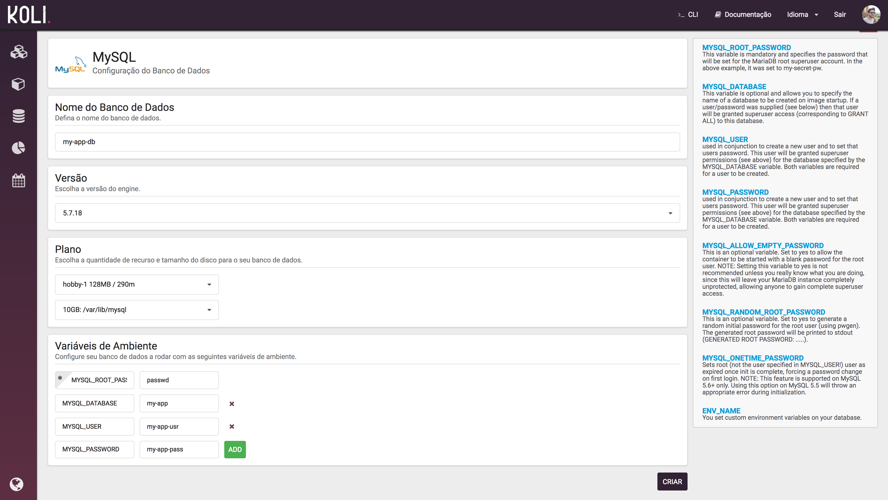
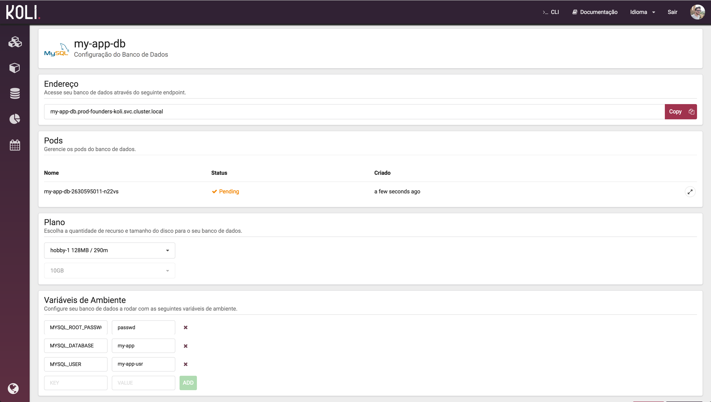

Neste guia, vamos simular a migração de um banco de dados MySQL. Vamos cobrir os seguintes tópicos:

* TOC
{:toc}

### Criar um Banco de Dados MySQL

No menu esquerdo clique no icone <i class="tab-icon fa fa-database"></i>e em seguida  para adicionar um novo Banco de Dados.

<div class="article-image">
  <a href="images/db_mig_empty_list.png"></a>
</div>

No Catálogo selecione `MySQL` no grupo de banco de dados relacionais.

<div class="article-image">
  <a href="images/db_mig_catalog.png"></a>
</div>

Defina um nome para o container do banco, a versão do `MySQL` o tamanho do container e do disco. Voce também precisa definir a senha do usuário root do banco através de variável de ambiente.

Também é possível adicionar outras configurações, no exemplo abaixo configuramos também a criação automática de um banco de dados `my-app` e um usuário e senha para acessá-lo.

<div class="alert alert-info">
  <strong>Nota: </strong>No menu direito é possível ver as configurações disponíveis via variável de ambiente. Clique no nome da variável para auto preenchimento da chave.
</div>

<div class="article-image">
  <a href="images/db_mig_create_mysql.png"></a>
</div>

Ao criar o Banco de Dados vemos o estado do container e o endereço de acesso. Esse endereço é um [Service]({{ site.baseurl }}/concepts/services.html) que sua aplicação irá utilizar para acessar o Banco internamente. Copie esse endereço para configurar sua aplicação posteriormente.

<div class="article-image">
  <a href="images/db_mig_config_mysql.png"></a>
</div>

### Exportar o antigo Banco de Dados

Exporte o banco antigo utilizando o [mysqldump](https://dev.mysql.com/doc/refman/5.7/en/mysqldump.html).

``` bash
$ mysqldump [options] > dump.sql
```

Nesse exemplo estamos exportando para o arquivo `dump.sql`. 

### Importar o arquivo de dump

Certifique-se que já possui a [CLI]({{ site.baseurl }}/guides/cli.html) na sua máquina local.

Localize o nome do `Pod` do banco de dados criado.

```
$ kubectl -n dev-acme-koli get po
NAME                         READY     STATUS    RESTARTS   AGE
my-app-db-2700401046-nckcq   1/1       Running   0          3m
```

Vamos mapear a porta do `MySQL` localmente utilizando o comando port-forward.

``` bash
$ kubectl -n dev-acme-koli  port-forward my-app-db-2700401046-nckcq 3306
Forwarding from 127.0.0.1:3306 -> 3306
Forwarding from [::1]:3306 -> 3306
Handling connection for 3306
Handling connection for 3306
```

<div class="alert alert-info">
  <strong>Nota:</strong> Com o comando acima agora podemos acessar o MySQL via endereço local <strong>127.0.0.1</strong>.
</div>

Na criação do container passamos como variável de ambiente `MYSQL_DATABASE`, `MYSQL_USER` e `MYSQL_PASSWORD` que criou o banco de dados, usuário e senha a esse banco automáticamente.

```bash
$ mysql -h 127.0.0.1 -u my-app-usr  --password=my-app-pass -e "SHOW DATABASES";
mysql: [Warning] Using a password on the command line interface can be insecure.
+--------------------+
| Database           |
+--------------------+
| information_schema |
| my-app             |
+--------------------+
```

Agora basta importar o arquivo `dump.sql` exportado do [passo anterior](#exportar-o-antigo-banco-de-dados) com o comando abaixo.

``` bash
mysql -h 127.0.0.1 -u my-app-usr  --password=my-app-pass my-app < dump.sql
```

