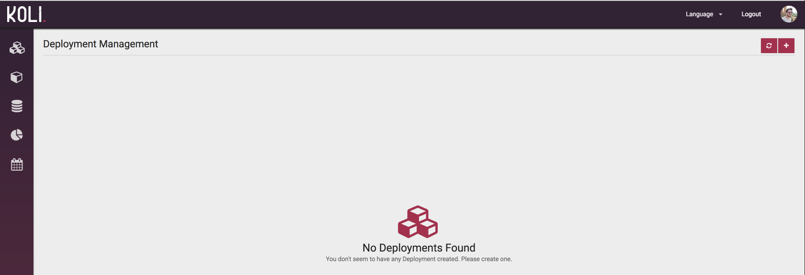
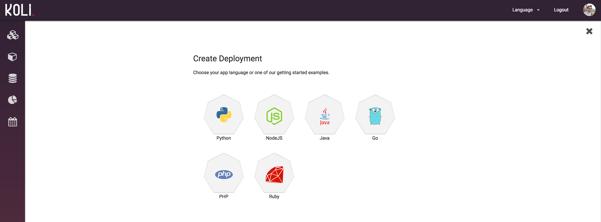
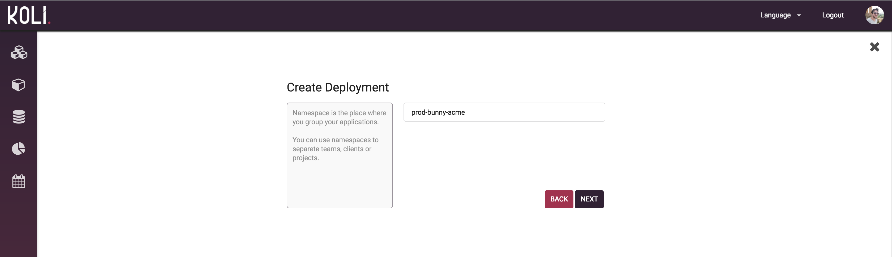
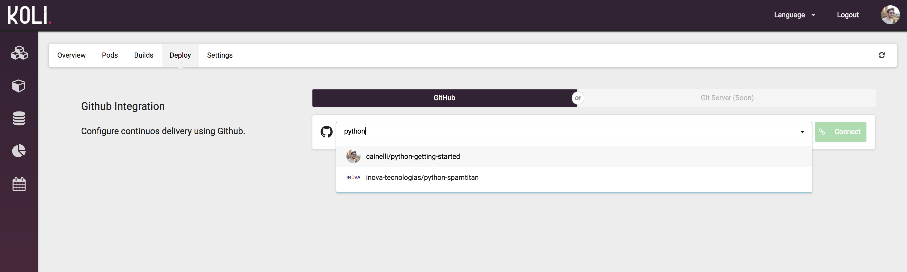
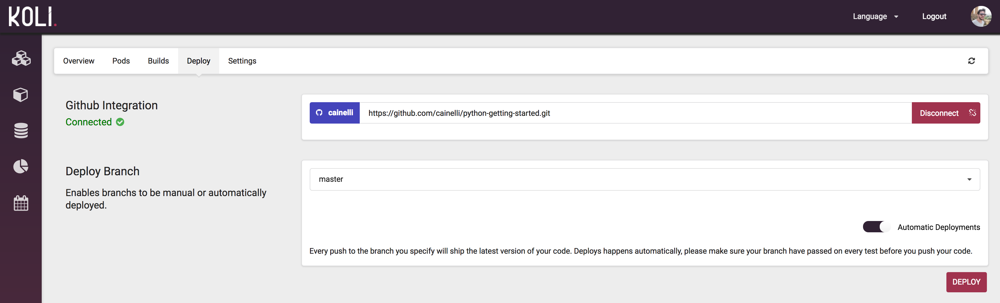
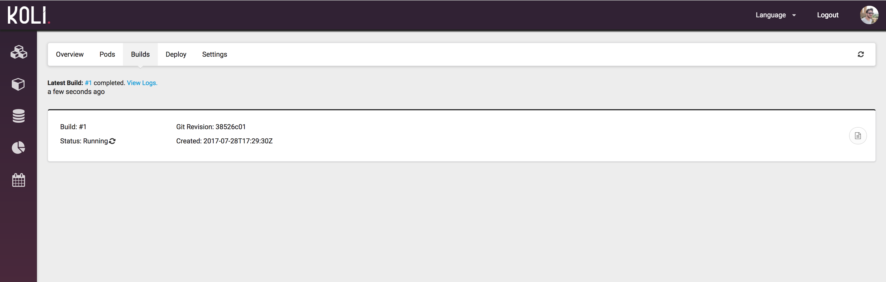
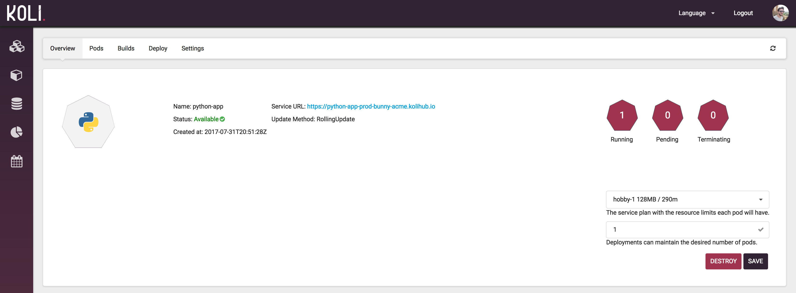
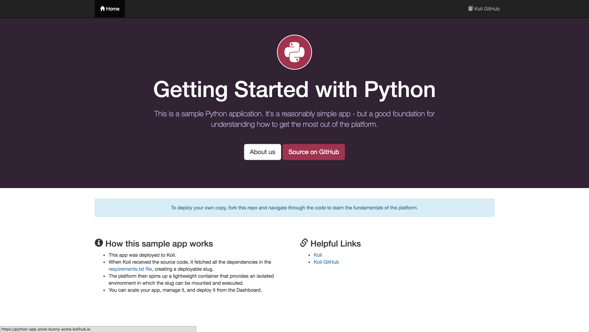

<strong>Atenção: </strong>É necessário ter uma conta no GitHub. Se ainda não possui cadastre-se <a href="https://github.com/join">aqui</a>

* TOC
{:toc}

### Video Guia

  <iframe width="560" height="315" src="https://www.youtube.com/embed/PBbjxXwBHIY" frameborder="0" allowfullscreen></iframe>

### Fork no GitHub

Faça um fork do projeto de quick start <a href="https://github.com/koli/python-getting-started"><i class="tab-icon fa fa-code-fork"></i>python-getting-started</a>.

### Criar o Deployment

Acesse o Koli Dashboard. Clique no botão  para adicionar um novo ___Deployment___.

  

Para esse quickstart defina a linguagem `Python`.

  

Defina o ___Namespace___ que o ___Deployment___ será criado, em seguida clique em `NEXT`.

  

Escolha agora o nome do seu Deployment. Em seguinda clique em `CREATE`

  

### Conectar ao Repositório

Agora vamos conectar o repositório que fizemos o fork ao ___Deployment___. Nesse momento voce deve conseguir buscar seus repositórios, comece digitando o nome do repositório `python-getting-started` para seleciona-lo.

Quando selecionar o repositório desejado clique em `Connect`.

  

Com o repositório conectado ative a opção `Automatic Deployments`. Isso irá criar automáticamente um [Webhook](https://developer.github.com/webhooks/) neste repositório.

  <strong>Nota: </strong>A cada novo commit será enviado um hook para o Koli. Este hook servirá de gatilho para um novo build e deploy da nova versão do código.

### Iniciando o Build

Em seguida clique em `Deploy` para iniciar __manualmente__ um deploy da branch selecionada. No caso abaixo a branch `master`.

  

O build deverá ter sido iniciado, se não visualizar clique no botão <i class="tab-icon fa fa-refresh"></i> para atualizar a lista de builds.

  <strong>Dica: </strong>Voce pode visualizar os Logs do build em andamento clicando no botão <i class="tab-icon fa fa-file-text-o"></i>.

  

### Acessando a Aplicação

Entre em overview para ter acesso ao endereço customizado da sua aplicação. Todas as aplicações possuem um endereço padrão __https://${nome_do_app}-${namespace}.kolihub.io__. 

  

Agora você pode acessar o link que deverá ver sua aplicação rodando.

  

